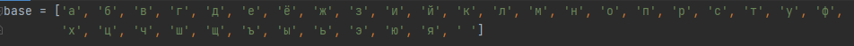
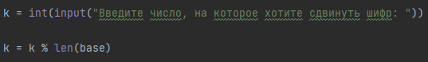
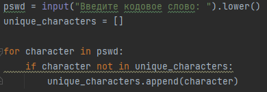
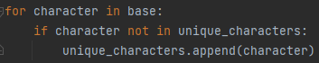
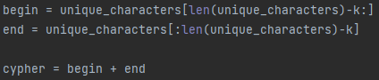
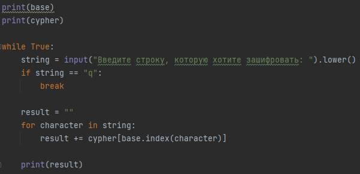
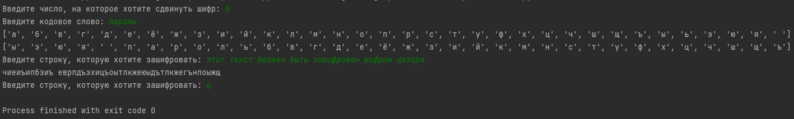
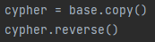
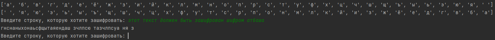

---
# Front matter
title: "Математические основы защиты информации и информационной безопасности. Отчет по лабораторной работе №1"
subtitle: "Шифры простой замены"
author: "Юдин Герман Станиславович 1132236901"
group: "НФИмд-02-23"
institute: RUDN University, Moscow, Russian Federation

# Generic otions
lang: ru-RU
toc-title: "Содержание"

# Bibliography
csl: pandoc/csl/gost-r-7-0-5-2008-numeric.csl

# Pdf output format
toc: true # Table of contents
toc_depth: 2
lof: true # List of figures
lot: true # List of tables
fontsize: 12pt
linestretch: 1.5
papersize: a4
documentclass: scrreprt
### Fonts
mainfont: PT Serif
romanfont: PT Serif
sansfont: PT Sans
monofont: PT Mono
mainfontoptions: Ligatures=TeX
romanfontoptions: Ligatures=TeX
sansfontoptions: Ligatures=TeX,Scale=MatchLowercase
monofontoptions: Scale=MatchLowercase,Scale=0.9
## Biblatex
biblatex: true
biblio-style: "gost-numeric"
biblatexoptions:
  - parentracker=true
  - backend=biber
  - hyperref=auto
  - language=auto
  - autolang=other*
  - citestyle=gost-numeric
## Misc options
indent: true
header-includes:
  - \linepenalty=10 # the penalty added to the badness of each line within a paragraph (no associated penalty node) Increasing the value makes tex try to have fewer lines in the paragraph.
  - \interlinepenalty=0 # value of the penalty (node) added after each line of a paragraph.
  - \hyphenpenalty=50 # the penalty for line breaking at an automatically inserted hyphen
  - \exhyphenpenalty=50 # the penalty for line breaking at an explicit hyphen
  - \binoppenalty=700 # the penalty for breaking a line at a binary operator
  - \relpenalty=500 # the penalty for breaking a line at a relation
  - \clubpenalty=150 # extra penalty for breaking after first line of a paragraph
  - \widowpenalty=150 # extra penalty for breaking before last line of a paragraph
  - \displaywidowpenalty=50 # extra penalty for breaking before last line before a display math
  - \brokenpenalty=100 # extra penalty for page breaking after a hyphenated line
  - \predisplaypenalty=10000 # penalty for breaking before a display
  - \postdisplaypenalty=0 # penalty for breaking after a display
  - \floatingpenalty = 20000 # penalty for splitting an insertion (can only be split footnote in standard LaTeX)
  - \raggedbottom # or \flushbottom
  - \usepackage{float} # keep figures where there are in the text
  - \floatplacement{figure}{H} # keep figures where there are in the text
---

# Цель работы

Освоить на практике шифры простой замены.

# Выполнение лабораторной работы

Требуется реализовать:

1. Шифр Цезаря с произвольным ключом K.
2. Шифр Атбаш.

## Шифр цезаря

Шифр Цезаря (также он является шифром простой замены) — это моноалфавитная подстановка, т.е. 
каждой букве открытого текста ставится в соответствие одна буква шифртекста. 
На практике при создании шифра простойзамены в качестве шифроалфавита берется исходный алфавит, но с нарушеннымпорядком букв (алфавитная перестановка). 
Для запоминания нового порядкабукв перемешивание алфавита осуществляется с помощью пароля. 
В качествепароля могут выступать слово или несколько слов с неповторяющимися буквами.
Шифровальная таблица состоит из двух строк: в первой записывается стандартный алфавит открытого текста, 
во второй — начиная с некоторой позицииразмещается пароль (пробелы опускаются), 
а далее идут в алфавитном порядке оставшиеся буквы, не вошедшие в пароль. 
В случае несовпадения начала пароля с началом строки процесс после ее завершения циклически продолжается с первой позиции. 
Ключом шифра служит пароль вместе с числом, указывающим положение начальной буквы пароля.

Чтобы реализовать программу был написал след. код на python:

Выписан алфавит с учетом возможного пробела [@fig:1].

{#fig:1 width=100%}

Вводится число, на которое будет произведен сдвиг. Даже если число слишком большое оно преобразуется в возможный интервал (берётся остаток от деления) [@fig:2].

{#fig:2 width=100%}

Вводится контрольное слово, у которого берутся только уникальные символы [@fig:3].

{#fig:3 width=100%}

После слова добавляется весь оставшийся алфавит [@fig:4].

{#fig:4 width=100%}

Происходит перемещение k символов в начало [@fig:5].

{#fig:5 width=100%}

Выводятся оба алфавита. А также происходит ввод фразы, которую хотим зашифровать. Шифрование происходит за счет вычиления индекса символа и выбора символа из зашифрованного алфавита по данному символу [@fig:6].

{#fig:6 width=100%}

Результат работы алгоритма представлен на рисунке [@fig:7].

{#fig:7 width=100%}

## Шифр атбаш

Данный шифр является шифром сдвига на всю длину алфавита, состоящего из русских букв и пробела.

Чтобы реализовать программу был написал след. код на python:

Выписан алфавит с учетом возможного пробела [@fig:8].

{#fig:8 width=100%}

Алфавит разворачивается [@fig:9].

{#fig:9 width=100%}

Выводятся оба алфавита. А также происходит ввод фразы, которую хотим зашифровать. Шифрование происходит за счет вычиления индекса символа и выбора символа из зашифрованного алфавита по данному символу [@fig:10].

{#fig:10 width=100%}

Результат работы алгоритма представлен на рисунке [@fig:1].

{#fig:11 width=100%}

# Выводы

В результате выполнения работы я освоил на практике применение шифров простой замены.

# Список литературы

1. Методические материалы курса
